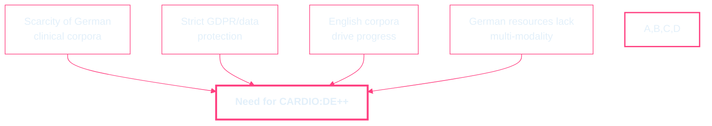
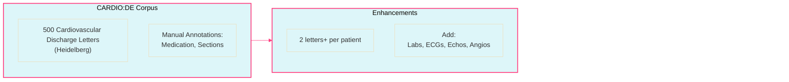
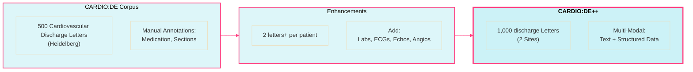
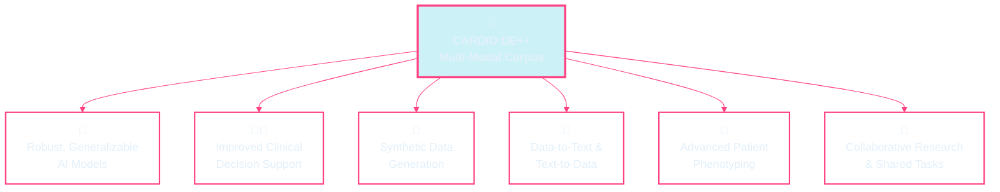

```mermaid
%%{init: {'theme': 'base', 'themeVariables': { 'mainBkg': 'transparent' }}}%%
flowchart LR
    subgraph CARDIO_DE["CARDIO:DE Corpus"]
      A1["500 Cardiovascular Discharge Letters<br/>(Heidelberg)"]
      A2["Manual Annotations:<br/>Medication, Sections"]
    end
    subgraph EXT["Enhancements"]
      B1["2 letters+ per patient"]
      B2["Add:<br> Labs, ECGs, Echos, Angios"]
    end
    subgraph CARDIO_DEPP["CARDIO:DE++"]
      C1["1,000 discharge Letters<br/>(2 Sites)"]
      C2["Multi-Modal:<br/>Text + Structured Data"]
    end
    CARDIO_DE --> EXT
    EXT --> CARDIO_DEPP
    style CARDIO_DE fill:transparent,stroke:#ff4081,stroke-width:2px, primaryTextColor:'#e3f0fa', 
    style EXT fill:transparent,stroke:transparent,color:transparent
    style CARDIO_DEPP fill:transparent,stroke:transparent,color:transparent
    style B1 color:transparent,fill:transparent,stroke:transparent
    style B2 color:transparent,fill:transparent,stroke:transparent
    style C1 color:transparent,fill:transparent,stroke:transparent
    style C2 color:transparent,fill:transparent,stroke:transparent
    linkStyle 0,1 stroke:transparent

    classDef leaf fill:transparent,stroke:#ff4081,stroke-width:2px,color:#e3f0fa;
```

  <h1 style="font-size: 2.8em; color: #00bcd4; margin-bottom: 0.2em; text-shadow: 0 2px 12px #0f2027cc;">
    CARDIO:DE++
  </h1>
  <h3 style="color: #e3f0fa; margin-bottom: 0.7em; text-shadow: 0 2px 8px #1976d2cc;">
    Powering Next-Generation Cardiovascular AI 
    with a Rich, Multi-Modal German Clinical Corpus
  </h3>

  <!-- ECG Monitor Container -->
  

    <svg class="ecg-monitor-svg" viewBox="0 0 800 60" fill="none">
      <!-- The static ECG path that is revealed by the mask -->
      <path
        d="M-100,30 L0,30 C5,30 8,26 12,30 L20,30 L25,33 L35,5 L42,58 L50,30 L70,30 C80,30 90,18 105,30 L200,30 C205,30 208,26 212,30 L220,30 L225,33 L235,5 L242,58 L250,30 L270,30 C280,30 290,18 305,30 L400,30 C405,30 408,26 412,30 L420,30 L425,33 L435,5 L442,58 L450,30 L470,30 C480,30 490,18 505,30 L600,30 C605,30 608,26 612,30 L620,30 L625,33 L635,5 L642,58 L650,30 L670,30 C680,30 690,18 705,30 L800,30 L900,30"
        stroke="#ff4081"
        stroke-width="2.5"
        stroke-linecap="round"
        fill="none"
        opacity="0.6"
      />
      <!-- The <circle> element has been removed -->
    </svg>
  

  

    <b>Philipp Wiesenbach, Prof. Christoph Dieterich, Prof. Nicolas Geis (UKHD)</b> 
    <b>Simone Britsch (UMM)<em>tbd.</em></b> 
  

---

Motivation

<ul class="themed-list">
  <li>
    
      Scarcity of high-quality, freely accessible German clinical text corpora
      

    
  </li>
  <li>
    
      Strict data protection (GDPR) limits data sharing
      

    
  </li>
  <li>
    
      Existing English corpora (e.g., MIMIC-III, i2b2) have driven clinical NLP
      

    
  </li>
  <li>
    
      German resources are limited and lack multi-modal, parallel data
      

    
  </li>
</ul>

---

## State of the Art

  

    <ul>
      <li><b>English corpora:</b> MIMIC-III, MIMIC-IV-Note, i2b2, CLEF, SemEval, THYME</li>
      <li><b>European corpora:</b> MERLOT (French), IULA (Spanish)</li>
      <li><b>German corpora:</b> GGPONC 2.0, 200 Oncological Discharge Summaries, GRASSCO, JSynCC</li>
      <li><b>Gap:</b> No large, multi-modal, parallel German cardiovascular corpus</li>
    </ul>
  

  

    
    

      <i>MIMIC-III: A leading English clinical corpus. 
      Source: <a href="https://physionet.org/content/mimiciii/1.4/" target="_blank" style="color:#90caf9;">PhysioNet</a></i>
    

  

---

## Preliminary Work

  

    <ul>
      <li>Developed de-identification and NER methods for German medical texts</li>
      <li>Achieved F2-scores up to 96% for de-identification</li>
      <li>Created and published the CARDIO:DE corpus:
        <ul>
          <li>500 cardiovascular doctor's letters</li>
          <li>993,143 tokens, 31,952 unique tokens</li>
          <li>High-quality medication and section annotations</li>
        </ul>
      </li>
      <li>CARDIO:DE is freely available for research</li>
    </ul>
  

  

    
    

      <i>Figure 3: CARDIO:DE annotation statistics and inter-annotator agreement. 
      Source: <a href="https://www.nature.com/articles/s41597-023-02128-9" target="_blank" style="color:#90caf9;">Richter-Pechanski et al., Scientific Data 2023</a></i>
    

  

---

## Why CARDIO:DE++?

<!-- What is missing in existing corpora -->

  <b style="color: #ff9800; font-size: 1.1em;">Existing corpora lack:</b>
  <ul style="list-style: disc inside; padding-left: 0; margin-top: 0.6em;">
    <li>
      
        Multi-site data (risk of site bias)
        
      
    </li>
    <li>
      
        Explicitly parallel, multi-modal patient data
        
      
    </li>
  </ul>

<!-- What CARDIO:DE++ will contribute -->

  <b style="color: #1976d2; font-size: 1.1em;">CARDIO:DE++ will:</b>
  <ul style="list-style: disc inside; padding-left: 0; margin-top: 0.6em;">
    <li>
      
        Collect 1,000 discharge letters collected from two sites (UKHD & UMM)
        
      
    </li>
    <li>
      
        Collect data from differnt stays per patient enabling longitudinal analyes
        
      
    </li>
    <li>
      
        Add a multitude of medical examination data per patient 
        
      
    </li>
    <li>
      
        Actively steer the corpus design towards least exhibited bias
        
      
    </li>
  </ul>

---

## Project Objectives

<!-- 
  This container uses flexbox to create a responsive 2x2 grid.
  - flex-grow: 1 allows it to fill the available vertical space.
  - The gap and padding on the items have been reduced to prevent overflow.
-->

  <!-- O1: Enhance Corpus Heterogeneity -->
  

    🧬
    <b>Enhance Corpus Heterogeneity</b>
    
Expand to 1,000 letters from two sites to build generalizable AI models and mitigate site-specific bias.

  

  <!-- O2: Enable Longitudinal Assessment -->
  

    📈
    <b>Enable Longitudinal Assessment</b>
    
Collect multiple letters per patient to enable the study of disease progression and treatment response over time.

  

  <!-- O3: Create a Rich Multi-Modal Resource -->
  

    📊
    <b>Create a Rich Multi-Modal Resource</b>
    
Link clinical text with structured data, ECGs, and echocardiogram videos for advanced, integrated AI models.

  

  <!-- O4: Proactively Mitigate Data Bias -->
  

    🛡️
    <b>Proactively Mitigate Data Bias</b>
    
Ensure data quality and adhere to FAIR/CARE principles to foster the development of fairer and more robust AI systems.

  

---

## CARDIO:DE++ Enhancements & Enablements

<!-- This flex container manages the vertical layout of the two diagrams -->

<!-- 
  This container uses v-clicks to overlay three diagrams.
  Each diagram contains the *full* layout, but styles future elements
  to be invisible, preventing any resizing or repositioning on click.
-->

<v-clicks>

<!-- Step 1: Only CARDIO:DE is visible -->

<!-- Step 2: CARDIO:DE and Enhancements are visible -->

<!-- Step 3: Full diagram is visible -->

</v-clicks>

---

## Graphical Abstract

<!-- This container uses flexbox to fill the remaining vertical space and create two columns -->

  <!-- Left Column: Previous Work -->
  

    <h3 style="color: #90caf9; margin-bottom: 1em; font-size: 1.2em;">Previous Work</h3>
    
  

  <!-- Right Column: This Proposal -->
  

    <h3 style="color: #90caf9; margin-bottom: 1em; font-size: 1.2em;">Proposed Project</h3>
    
  

---

## Work Packages Overview

| WP  | Title                                   | Months      |
|-----|-----------------------------------------|-------------|
| WP1 | Ethics, Legal Framework & Onboarding    | 1–5         |
| WP2 | Data Acquisition                        | 1–6        |
| WP3 | De-identification                       | 2–12        |
| WP4 | Annotation                              | 6–18        |
| WP5 | Advanced AI Model Development           | 13–21       |
| WP6 | Dissemination & Sustainability          | 19–24       |

---

## WP1: Ethics, Legal Framework & Site Onboarding

<ul>
  <li><b>Months:</b> 1–5</li>
  <li><b>Objective:</b> Secure ethical/legal approvals and establish data sharing protocols</li>
  <li><b>Key Tasks:</b>
    <ul>
      <li>Ethics applications for both sites</li>
      <li>Standardized patient consent forms</li>
      <li>Data Use/Transfer Agreements (DUAs/DTAs)</li>
      <li>SOPs for data handling and training</li>
    </ul>
  </li>
  <li><b>Deliverables:</b> Approved ethics, signed DUAs/DTAs, consent forms, SOPs</li>
  <li><b>Lead:</b> Heidelberg (with UMM)</li>
</ul>

  📚
  
    <b style="font-weight: 600; color: #1976d2;">Further reading:</b>
    <ul style="margin: 0.3em 0 0 0.7em;">
      <li>
        <a href="https://gdpr.eu/" target="_blank">GDPR (General Data Protection Regulation)</a>
      </li>
    </ul>
  

---

## WP2: Data Acquisition

<ul>
  <li><b>Months:</b> 2–6</li>
  <li><b>Objective:</b> Collect 1,000 new discharge letters and structured tabular data</li>
  <li><b>Key Tasks:</b>
    <ul>
      <li>Patient consent and data collection at both sites</li>
      <li>extract structured numerical/categorical data and link to SNOMED CT</li>
      <li>Collect textual reports of findings from echocardiograms and coronary angiography</li>
      <li>Acquire echocardiogram videos in suitable digital formats, preserving resolution for analysis.</li>
      <li>Acquire contemporaneous 12-lead ECGs as raw digital time series data.</li>
    </ul>
  </li>
  <li><b>Deliverables:</b> 1,000 raw discharge letters + structured data</li>
  <li><b>Lead:</b> Heidelberg & UMM</li>
</ul>

  📝
  
    <b style="font-weight: 600; color: #1976d2;">Reference:</b>
    <a href="https://www.nature.com/articles/sdata201635" target="_blank">
      Johnson AEW et al., MIMIC-III Data Collection Protocol, Scientific Data (2016)
    </a>
  

---

## WP3: De-identification

<ul>
  <li><b>Months:</b> 2–12</li>
  <li><b>Objective:</b> De-identify all textual and tabular data</li>
  <li><b>Key Tasks:</b>
    <ul>
      <li>Apply/refine CARDIO:DE de-identification models</li>
      <li>Manual review and correction</li>
      <li>Clean, standardize, and anonymize tabular data</li>
    </ul>
  </li>
  <li><b>Deliverables:</b> 1,000 de-identified discharge letters, the corresponding de-identified and linked structured tabular data, along with a comprehensive de-identification quality report, and a DFG 12-month status report </li>
  <li><b>Lead:</b> Heidelberg</li>
</ul>

  🔒
  
    <b style="font-weight: 600; color: #1976d2;">Key resource:</b>
    <a href="https://iapp.org/news/a/does-anonymization-or-de-identification-require-consent-under-the-gdpr" target="_blank">
      Does anonymization or de-identification require consent under the GDPR?
    </a>
  

---

## Joint Annotation Process

  

---

## WP4: Annotation

<ul>
  <li><b>Months:</b> 6–18</li>
  <li><b>Objective:</b> Annotate new data using established schemes</li>
  <li><b>Key Tasks:</b>
    <ul>
      <li>Apply CARDIO:DE annotation schemes (medication, section classes)</li>
      <li>Inter-annotator agreement studies</li>
      <li>Link text to tabular data via anonymized IDs</li>
    </ul>
  </li>
  <li><b>Deliverables:</b> Fully annotated CARDIO:DE++ corpus (including medication/section classes for new letters/reports); linked 12-lead ECGs, structured numerical/categorical data, and echocardiogram videos; new annotation layers; updated guidelines; comprehensive IAA reports</li>
  <li><b>Lead:</b> Heidelberg</li>
</ul>

  🖊️
  
    <b style="font-weight: 600; color: #1976d2;">See also:</b>
    <a href="https://www.nature.com/articles/s41597-023-02128-9" target="_blank">
      CARDIO:DE Corpus Publication (Richter-Pechanski et al., 2023)
    </a>
  

---

## WP5: Advanced AI Model Development

<ul>
  <li><b>Months:</b> 13–23</li>
  <li><b>Objective:</b> Develop and evaluate advanced AI models</li>
  <li><b>Key Tasks:</b>
    <ul>
      <li>Fine-tune LLMs for synthetic data</li>
      <li>Develop data-to-text & text-to-data models</li>
      <li>Develop/evaluate multimodal models integrating text, structured , ECG, and Echo video data</li>
    </ul>
  </li>
  <li><b>Deliverables:</b> Fine-tuned generative LLMs; evaluated corpus of synthetic discharge letters/reports; developed/evaluated data-to-text and text-to-data NLP models; report on advanced patient phenotyping; baseline performance metrics on CARDIO:DE++.</li>
  <li><b>Lead:</b> Heidelberg</li>
</ul>

  🤖
  
    <b style="font-weight: 600; color: #1976d2;">Further reading:</b>
    <a href="https://arxiv.org/abs/2305.09617" target="_blank">
      Med-PaLM: Towards Expert-Level Medical Question Answering with Large Language Models
    </a>
  

---

## WP6: Dissemination, Publication & Sustainability

<ul>
  <li><b>Months:</b> 18–24</li>
  <li><b>Objective:</b> Maximize impact and ensure sustainability</li>
  <li><b>Key Tasks:</b>
    <ul>
      <li>Public release of CARDIO:DE++ corpus</li>
      <li>Documentation and usage examples</li>
      <li>Long-term maintenance plan</li>
      <li>Shared Tasks?</li>
    </ul>
  </li>
  <li><b>Deliverables:</b> Released corpus, documentation, publications, sustainability plan</li>
  <li><b>Lead:</b> Heidelberg</li>
</ul>

  🌐
  
    <b style="font-weight: 600; color: #1976d2;">Open Science & FAIR Data:</b>
    <a href="https://www.go-fair.org/fair-principles/" target="_blank">
      FAIR Data Principles
    </a>
  

---

## Timeline working packages

<table class="timeline-table">
  <tr>
    <th></th>
    <th>1</th><th>2</th><th>3</th><th>4</th><th>5</th><th>6</th><th>7</th><th>8</th><th>9</th><th>10</th><th>11</th><th>12</th>
    <th>13</th><th>14</th><th>15</th><th>16</th><th>17</th><th>18</th><th>19</th><th>20</th><th>21</th><th>22</th><th>23</th><th>24</th>
  </tr>
  <tr>
    <td class="timeline-label">WP1</td>
    <td class="timeline-bar"></td><td class="timeline-bar"></td><td class="timeline-bar"></td>
    <td class="timeline-bar"></td><td class="timeline-bar"></td><td class="timeline-empty"></td>
    <td class="timeline-empty"></td><td class="timeline-empty"></td><td class="timeline-empty"></td>
    <td class="timeline-empty"></td><td class="timeline-empty"></td><td class="timeline-empty"></td>
    <td class="timeline-empty"></td><td class="timeline-empty"></td><td class="timeline-empty"></td>
    <td class="timeline-empty"></td><td class="timeline-empty"></td><td class="timeline-empty"></td>
    <td class="timeline-empty"></td><td class="timeline-empty"></td><td class="timeline-empty"></td>
    <td class="timeline-empty"></td><td class="timeline-empty"></td><td class="timeline-empty"></td>
  </tr>
  <tr>
    <td class="timeline-label">WP2</td>
    <td class="timeline-bar"></td><td class="timeline-bar"></td><td class="timeline-bar"></td>
    <td class="timeline-bar"></td><td class="timeline-bar"></td><td class="timeline-bar"></td>
    <td class="timeline-empty"></td><td class="timeline-empty"></td><td class="timeline-empty"></td>
    <td class="timeline-empty"></td><td class="timeline-empty"></td><td class="timeline-empty"></td>
    <td class="timeline-empty"></td><td class="timeline-empty"></td><td class="timeline-empty"></td>
    <td class="timeline-empty"></td><td class="timeline-empty"></td><td class="timeline-empty"></td>
    <td class="timeline-empty"></td><td class="timeline-empty"></td><td class="timeline-empty"></td>
    <td class="timeline-empty"></td><td class="timeline-empty"></td><td class="timeline-empty"></td>
  </tr>
  <tr>
    <td class="timeline-label">WP3</td>
    <td class="timeline-empty"></td>
    <td class="timeline-bar"></td><td class="timeline-bar"></td><td class="timeline-bar"></td>
    <td class="timeline-bar"></td><td class="timeline-bar"></td><td class="timeline-bar"></td>
    <td class="timeline-bar"></td><td class="timeline-bar"></td><td class="timeline-bar"></td>
    <td class="timeline-bar"></td><td class="timeline-bar"></td>
    <td class="timeline-empty"></td><td class="timeline-empty"></td><td class="timeline-empty"></td>
    <td class="timeline-empty"></td><td class="timeline-empty"></td><td class="timeline-empty"></td>
    <td class="timeline-empty"></td><td class="timeline-empty"></td><td class="timeline-empty"></td>
    <td class="timeline-empty"></td><td class="timeline-empty"></td><td class="timeline-empty"></td>
  </tr>
  <tr>
    <td class="timeline-label">WP4</td>
    <td class="timeline-empty"></td><td class="timeline-empty"></td><td class="timeline-empty"></td>
    <td class="timeline-empty"></td><td class="timeline-empty"></td>
    <td class="timeline-bar"></td><td class="timeline-bar"></td><td class="timeline-bar"></td>
    <td class="timeline-bar"></td><td class="timeline-bar"></td><td class="timeline-bar"></td>
    <td class="timeline-bar"></td><td class="timeline-bar"></td><td class="timeline-bar"></td>
    <td class="timeline-bar"></td><td class="timeline-bar"></td><td class="timeline-bar"></td>
    <td class="timeline-bar"></td><td class="timeline-empty"></td><td class="timeline-empty"></td>
    <td class="timeline-empty"></td><td class="timeline-empty"></td><td class="timeline-empty"></td>
    <td class="timeline-empty"></td>
  </tr>
  <tr>
    <td class="timeline-label">WP5</td>
    <td class="timeline-empty"></td><td class="timeline-empty"></td><td class="timeline-empty"></td>
    <td class="timeline-empty"></td><td class="timeline-empty"></td><td class="timeline-empty"></td>
    <td class="timeline-empty"></td><td class="timeline-empty"></td><td class="timeline-empty"></td>
    <td class="timeline-empty"></td><td class="timeline-empty"></td><td class="timeline-bar"></td>
    <td class="timeline-bar"></td><td class="timeline-bar"></td><td class="timeline-bar"></td>
    <td class="timeline-bar"></td><td class="timeline-bar"></td><td class="timeline-bar"></td>
    <td class="timeline-bar"></td><td class="timeline-bar"></td><td class="timeline-bar"></td>
    <td class="timeline-empty"></td><td class="timeline-empty"></td><td class="timeline-empty"></td>
  </tr>
  <tr>
    <td class="timeline-label">WP6</td>
    <td class="timeline-empty"></td><td class="timeline-empty"></td><td class="timeline-empty"></td>
    <td class="timeline-empty"></td><td class="timeline-empty"></td><td class="timeline-empty"></td>
    <td class="timeline-empty"></td><td class="timeline-empty"></td><td class="timeline-empty"></td>
    <td class="timeline-empty"></td><td class="timeline-empty"></td><td class="timeline-empty"></td>
    <td class="timeline-empty"></td><td class="timeline-empty"></td><td class="timeline-empty"></td>
    <td class="timeline-empty"></td><td class="timeline-empty"></td><td class="timeline-empty"></td>
    <td class="timeline-bar"></td><td class="timeline-bar"></td><td class="timeline-bar"></td>
    <td class="timeline-bar"></td><td class="timeline-bar"></td><td class="timeline-bar"></td>
  </tr>
</table>

  <b>Legend:</b>
  <table class="timeline-legend-table">
    <tr>
      <td class="timeline-legend-wp">WP1</td>
      <td>Ethics, Legal Framework & Site Onboarding</td>
    </tr>
    <tr>
      <td class="timeline-legend-wp">WP2</td>
      <td>Data Acquisition</td>
    </tr>
    <tr>
      <td class="timeline-legend-wp">WP3</td>
      <td>De-identification</td>
    </tr>
    <tr>
      <td class="timeline-legend-wp">WP4</td>
      <td>Annotation</td>
    </tr>
    <tr>
      <td class="timeline-legend-wp">WP5</td>
      <td>Advanced AI Model Development</td>
    </tr>
    <tr>
      <td class="timeline-legend-wp">WP6</td>
      <td>Dissemination, Publication & Sustainability</td>
    </tr>
  </table>

---

## Summary: Expected Impact

  <ul style="list-style: disc inside; padding-left: 0; position: relative; z-index: 1;">
    <li v-click style="margin-bottom: 1.2em; display: flex; align-items: center;">
      
        First large, multi-modal, parallel German cardiovascular corpus
        
      
    </li>
    <li v-click style="margin-bottom: 1.2em; display: flex; align-items: center;">
      
        Enables robust, generalizable AI models for clinical NLP
        
      
    </li>
    <li v-click style="margin-bottom: 1.2em; display: flex; align-items: center;">
      
        Supports synthetic data generation and advanced patient phenotyping
        
      
    </li>
    <li v-click style="margin-bottom: 1.2em; display: flex; align-items: center;">
      
        Fosters collaboration and innovation in German-speaking clinical NLP
        
      
    </li>
  </ul>

---
layout: center
slidenumbers: false
---

<!-- The entire content is automatically centered by the layout -->

<h1>
  Thank you!
</h1>

<!-- 
  The SVG now contains a completely new path with 4 smaller, compressed peaks.
  The stroke-width is reduced for a finer look.
-->
<svg class="ecg-divider" viewBox="0 0 520 60" fill="none" xmlns="http://www.w3.org/2000/svg">
  <path
    d="M0,30 L20,30 C23,30 25,28 28,30 L35,30 L40,32 L45,20 L50,40 L55,30 L65,30 C70,30 75,26 80,30 L130,30 C133,30 135,28 138,30 L145,30 L150,32 L155,20 L160,40 L165,30 L175,30 C180,30 185,26 190,30 L260,30 C263,30 265,28 268,30 L275,30 L280,32 L285,20 L290,40 L295,30 L305,30 C310,30 315,26 320,30 L390,30 C393,30 395,28 398,30 L405,30 L410,32 L415,20 L420,40 L425,30 L435,30 C440,30 445,26 450,30 L520,30"
    stroke="#ff4081"
    stroke-width="2.5"
    stroke-linecap="round"
  />
</svg>

  <b>Philipp Wiesenbach</b> 
  <a href="mailto:philipp.wiesenbach@uni-heidelberg.de">philipp.wiesenbach@uni-heidelberg.de</a> 

