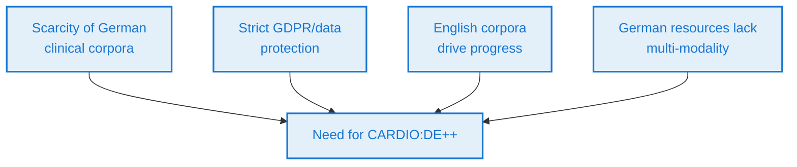
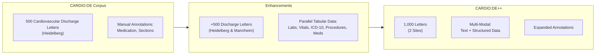
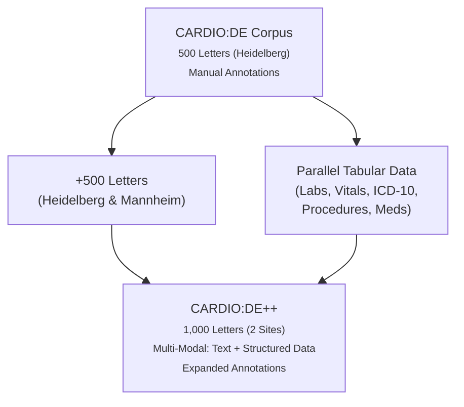
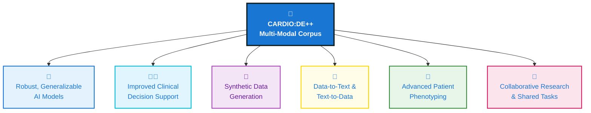

  <h1 style="font-size: 2.8em; color: #00bcd4; margin-bottom: 0.2em; text-shadow: 0 2px 12px #0f2027cc;">
    CARDIO:DE++
  </h1>
  <h3 style="color: #e3f0fa; margin-bottom: 0.7em; text-shadow: 0 2px 8px #1976d2cc;">
    Powering Next-Generation Cardiovascular AI 
    with a Rich, Multi-Modal German Clinical Corpus
  </h3>

  <!-- Animated, responsive ECG heartbeat line -->
  

    <svg
      v-motion="{
        initial: { x: 0, opacity: 0.18 },
        enter: { 
          x: [-800, 0], // animate from -800 to 0
          opacity: [0.18, 0.45, 0.18], 
          transition: { 
            duration: 3200, 
            times: [0, 0.5, 1], 
            repeat: Infinity, 
            repeatType: 'loop', 
            ease: 'linear' 
          }
        }
      }"
      width="200%" height="54" viewBox="0 0 3200 54" fill="none"
      style="display: block; position: absolute; left: 0; top: 0; min-width: 200%;">
      <path
        d="M0,40 
           L100,40 Q110,40 115,24 Q120,8 125,40 L200,40 Q210,40 213,36 Q216,32 219,40 L240,40
           Q243,40 246,25 Q249,10 252,40 L300,40 Q310,40 312,20 Q314,0 316,40 L318,40 Q319,45 320,10 Q321,5 322,40 L400,40
           L500,40 Q510,40 515,24 Q520,8 525,40 L600,40 Q610,40 613,36 Q616,32 619,40 L640,40
           Q643,40 646,25 Q649,10 652,40 L700,40 Q710,40 712,20 Q714,0 716,40 L718,40 Q719,45 720,10 Q721,5 722,40 L800,40
           L900,40 Q910,40 915,24 Q920,8 925,40 L1000,40 Q1010,40 1013,36 Q1016,32 1019,40 L1040,40
           Q1043,40 1046,25 Q1049,10 1052,40 L1100,40 Q1110,40 1112,20 Q1114,0 1116,40 L1118,40 Q1119,45 1120,10 Q1121,5 1122,40 L1200,40
           L1300,40 Q1310,40 1315,24 Q1320,8 1325,40 L1400,40 Q1410,40 1413,36 Q1416,32 1419,40 L1440,40
           Q1443,40 1446,25 Q1449,10 1452,40 L1500,40 Q1510,40 1512,20 Q1514,0 1516,40 L1518,40 Q1519,45 1520,10 Q1521,5 1522,40 L1600,40
           M1600,40 
           L1700,40 Q1710,40 1715,24 Q1720,8 1725,40 L1800,40 Q1810,40 1813,36 Q1816,32 1819,40 L1840,40
           Q1843,40 1846,25 Q1849,10 1852,40 L1900,40 Q1910,40 1912,20 Q1914,0 1916,40 L1918,40 Q1919,45 1920,10 Q1921,5 1922,40 L2000,40
           L2100,40 Q2110,40 2115,24 Q2120,8 2125,40 L2200,40 Q2210,40 2213,36 Q2216,32 2219,40 L2240,40
           Q2243,40 2246,25 Q2249,10 2252,40 L2300,40 Q2310,40 2312,20 Q2314,0 2316,40 L2318,40 Q2319,45 2320,10 Q2321,5 2322,40 L2400,40
           L2500,40 Q2510,40 2515,24 Q2520,8 2525,40 L2600,40 Q2610,40 2613,36 Q2616,32 2619,40 L2640,40
           Q2643,40 2646,25 Q2649,10 2652,40 L2700,40 Q2710,40 2712,20 Q2714,0 2716,40 L2718,40 Q2719,45 2720,10 Q2721,5 2722,40 L2800,40
           L2900,40 Q2910,40 2915,24 Q2920,8 2925,40 L3000,40 Q3010,40 3013,36 Q3016,32 3019,40 L3040,40
           Q3043,40 3046,25 Q3049,10 3052,40 L3100,40 Q3110,40 3112,20 Q3114,0 3116,40 L3118,40 Q3119,45 3120,10 Q3121,5 3122,40 L3200,40"
        stroke="#ff4081"
        stroke-width="4"
        fill="none"
      />
    </svg>
  

  

    <b>Philipp Wiesenbach, Prof. Christoph Dieterich, Prof. Nicolas Geis (UKHD)</b> 
    <b>Simone Britsch, <em>tbd.</em>, Prof. Daniel Dürschmied (UMM)</b> 
  

---

## Motivation

<!-- Animated, left-aligned ECG line that scrolls and fades in/out -->

<ul style="list-style: disc inside; padding-left: 0;">
  <li>
    
      Scarcity of high-quality, freely accessible German clinical text corpora
      
    
  </li>
  <li>
    
      Strict data protection (GDPR) limits data sharing
      
    
  </li>
  <li>
    
      Existing English corpora (e.g., MIMIC-III, i2b2) have driven clinical NLP
      
    
  </li>
  <li>
    
      German resources are limited and lack multi-modal, parallel data
      
    
  </li>
</ul>

---

## State of the Art

  

    <ul>
      <li><b>English corpora:</b> MIMIC-III, MIMIC-IV-Note, i2b2, CLEF, SemEval, THYME</li>
      <li><b>European corpora:</b> MERLOT (French), IULA (Spanish)</li>
      <li><b>German corpora:</b> GGPONC 2.0, 200 Oncological Discharge Summaries, GRASSCO, JSynCC</li>
      <li><b>Gap:</b> No large, multi-modal, parallel German cardiovascular corpus</li>
    </ul>
  

  

    
    

      <i>MIMIC-III: A leading English clinical corpus. 
      Source: <a href="https://physionet.org/content/mimiciii/1.4/" target="_blank" style="color:#90caf9;">PhysioNet</a></i>
    

  

---

## Preliminary Work

  

    <ul>
      <li>Developed de-identification and NER methods for German medical texts</li>
      <li>Achieved F2-scores up to 96% for de-identification</li>
      <li>Created and published the CARDIO:DE corpus:
        <ul>
          <li>500 cardiovascular doctor's letters</li>
          <li>993,143 tokens, 31,952 unique tokens</li>
          <li>High-quality medication and section annotations</li>
        </ul>
      </li>
      <li>CARDIO:DE is freely available for research</li>
    </ul>
  

  

    
    

      <i>Figure 3: CARDIO:DE annotation statistics and inter-annotator agreement. 
      Source: <a href="https://www.nature.com/articles/s41597-023-02128-9" target="_blank" style="color:#90caf9;">Richter-Pechanski et al., Scientific Data 2023</a></i>
    

  

---

## Why CARDIO:DE++?

<ul style="list-style: disc inside; padding-left: 0;">
  <li>
    
      Existing corpora lack:
      
    
    <ul>
      <li>
        
          Multi-site data (risk of site bias)
          
        
      </li>
      <li>
        
          Explicitly parallel, structured tabular data
          
        
      </li>
    </ul>
  </li>
  <li>
    
      CARDIO:DE++ will:
      
    
    <ul>
      <li>
        
          Add data from Universitätsklinikum Mannheim
          
        
      </li>
      <li>
        
          Link free-text with structured clinical parameters
          
        
      </li>
      <li>
        
          Enable advanced text-to-data and data-to-text AI models
          
        
      </li>
    </ul>
  </li>
</ul>

---

## Project Objectives

<ul>
  <li><b>Expand corpus heterogeneity:</b>  Add 500 new de-identified discharge letters from two sites</li>
  <li><b>Integrate structured tabular data:</b>  Laboratory values, vital signs, ICD-10 codes, procedures, medications</li>
  <li><b>Enable advanced AI research:</b>
    <ul>
      <li>Synthetic data generation</li>
      <li>Data-to-text and text-to-data NLP</li>
      <li>Patient phenotyping and subgroup discovery</li>
    </ul>
  </li>
</ul>

---

## CARDIO:DE++ Enhancements

<!-- 

-->

## CARDIO:DE++ Enablements

---

## Work Packages Overview

| WP  | Title                                   | Months      |
|-----|-----------------------------------------|-------------|
| WP1 | Ethics, Legal Framework & Onboarding    | 1–3         |
| WP2 | Data Acquisition                        | 1–12        |
| WP3 | De-identification                       | 2–12        |
| WP4 | Annotation                              | 6–24        |
| WP5 | Advanced AI Model Development           | 19–23       |
| WP6 | Dissemination & Sustainability          | 19–24       |

---

## WP1: Ethics, Legal Framework & Site Onboarding

<ul>
  <li><b>Months:</b> 1–3</li>
  <li><b>Objective:</b> Secure ethical/legal approvals and establish data sharing protocols</li>
  <li><b>Key Tasks:</b>
    <ul>
      <li>Ethics applications for both sites</li>
      <li>Standardized patient consent forms</li>
      <li>Data Use/Transfer Agreements (DUAs/DTAs)</li>
      <li>SOPs for data handling and training</li>
    </ul>
  </li>
  <li><b>Deliverables:</b> Approved ethics, signed DUAs/DTAs, consent forms, SOPs</li>
  <li><b>Lead:</b> Heidelberg (with UMM)</li>
</ul>

  📚
  
    <b style="font-weight: 600; color: #1976d2;">Further reading:</b>
    <ul style="margin: 0.3em 0 0 0.7em;">
      <li>
        <a href="https://gdpr.eu/" target="_blank">GDPR (General Data Protection Regulation)</a>
      </li>
    </ul>
  

---

## WP2: Data Acquisition

<ul>
  <li><b>Months:</b> 1–12</li>
  <li><b>Objective:</b> Collect 500 new discharge letters and structured tabular data</li>
  <li><b>Key Tasks:</b>
    <ul>
      <li>Patient consent and data collection at both sites</li>
      <li>Finalize list of structured data points (labs, ICD-10, vitals, meds, procedures)</li>
      <li>Extract and link data for each letter</li>
    </ul>
  </li>
  <li><b>Deliverables:</b> 500 raw discharge letters + structured data</li>
  <li><b>Lead:</b> Heidelberg & UMM</li>
</ul>

  📝
  
    <b style="font-weight: 600; color: #1976d2;">Reference:</b>
    <a href="https://www.nature.com/articles/sdata201635" target="_blank">
      Johnson AEW et al., MIMIC-III Data Collection Protocol, Scientific Data (2016)
    </a>
  

---

## WP3: De-identification

<ul>
  <li><b>Months:</b> 2–12</li>
  <li><b>Objective:</b> De-identify all textual and tabular data</li>
  <li><b>Key Tasks:</b>
    <ul>
      <li>Apply/refine CARDIO:DE de-identification models</li>
      <li>Manual review and correction</li>
      <li>Clean, standardize, and anonymize tabular data</li>
    </ul>
  </li>
  <li><b>Deliverables:</b> 500 de-identified letters, linked tabular data, quality report</li>
  <li><b>Lead:</b> Heidelberg</li>
</ul>

  🔒
  
    <b style="font-weight: 600; color: #1976d2;">Key resource:</b>
    <a href="https://www.ncbi.nlm.nih.gov/pmc/articles/PMC2995716/" target="_blank">
      Meystre et al., Review of De-identification Techniques for Clinical Text, JAMIA (2010)
    </a>
  

---

## WP4: Annotation

<ul>
  <li><b>Months:</b> 6–24</li>
  <li><b>Objective:</b> Annotate new data using established schemes</li>
  <li><b>Key Tasks:</b>
    <ul>
      <li>Apply CARDIO:DE annotation schemes (medication, section classes)</li>
      <li>Inter-annotator agreement studies</li>
      <li>Link text to tabular data via anonymized IDs</li>
      <li>(Optional) Explore explicit text-to-table linking</li>
    </ul>
  </li>
  <li><b>Deliverables:</b> Annotated CARDIO:DE++ corpus, guidelines, reports, splits</li>
  <li><b>Lead:</b> Heidelberg</li>
</ul>

  🖊️
  
    <b style="font-weight: 600; color: #1976d2;">See also:</b>
    <a href="https://www.nature.com/articles/s41597-023-02128-9" target="_blank">
      CARDIO:DE Corpus Publication (Richter-Pechanski et al., 2023)
    </a>
  

---

## WP5: Advanced AI Model Development

<ul>
  <li><b>Months:</b> 19–23</li>
  <li><b>Objective:</b> Develop and evaluate advanced AI models</li>
  <li><b>Key Tasks:</b>
    <ul>
      <li>Fine-tune LLMs for synthetic data</li>
      <li>Develop data-to-text & text-to-data models</li>
      <li>Patient phenotyping with multi-modal data</li>
    </ul>
  </li>
  <li><b>Deliverables:</b> Synthetic letters, evaluated models, phenotyping reports</li>
  <li><b>Lead:</b> Heidelberg</li>
</ul>

  🤖
  
    <b style="font-weight: 600; color: #1976d2;">Further reading:</b>
    <a href="https://arxiv.org/abs/2305.09617" target="_blank">
      Med-PaLM: Towards Expert-Level Medical Question Answering with Large Language Models
    </a>
  

---

## WP6: Dissemination, Publication & Sustainability

<ul>
  <li><b>Months:</b> 19–24</li>
  <li><b>Objective:</b> Maximize impact and ensure sustainability</li>
  <li><b>Key Tasks:</b>
    <ul>
      <li>Public release of CARDIO:DE++ corpus</li>
      <li>Documentation and usage examples</li>
      <li>Peer-reviewed publications and workshops</li>
      <li>Long-term maintenance plan</li>
    </ul>
  </li>
  <li><b>Deliverables:</b> Released corpus, documentation, publications, sustainability plan</li>
  <li><b>Lead:</b> Heidelberg</li>
</ul>

  🌐
  
    <b style="font-weight: 600; color: #1976d2;">Open Science & FAIR Data:</b>
    <a href="https://www.go-fair.org/fair-principles/" target="_blank">
      FAIR Data Principles
    </a>
  

---

## Timeline working packages

<table class="timeline-table">
  <tr>
    <th></th>
    <th>1</th><th>2</th><th>3</th><th>4</th><th>5</th><th>6</th><th>7</th><th>8</th><th>9</th><th>10</th><th>11</th><th>12</th>
    <th>13</th><th>14</th><th>15</th><th>16</th><th>17</th><th>18</th><th>19</th><th>20</th><th>21</th><th>22</th><th>23</th><th>24</th>
  </tr>
  <tr>
    <td class="timeline-label">WP1</td>
    <td class="timeline-bar"></td><td class="timeline-bar"></td><td class="timeline-bar"></td>
    <td class="timeline-empty"></td><td class="timeline-empty"></td><td class="timeline-empty"></td>
    <td class="timeline-empty"></td><td class="timeline-empty"></td><td class="timeline-empty"></td>
    <td class="timeline-empty"></td><td class="timeline-empty"></td><td class="timeline-empty"></td>
    <td class="timeline-empty"></td><td class="timeline-empty"></td><td class="timeline-empty"></td>
    <td class="timeline-empty"></td><td class="timeline-empty"></td><td class="timeline-empty"></td>
    <td class="timeline-empty"></td><td class="timeline-empty"></td><td class="timeline-empty"></td>
    <td class="timeline-empty"></td><td class="timeline-empty"></td><td class="timeline-empty"></td>
  </tr>
  <tr>
    <td class="timeline-label">WP2</td>
    <td class="timeline-bar"></td><td class="timeline-bar"></td><td class="timeline-bar"></td>
    <td class="timeline-bar"></td><td class="timeline-bar"></td><td class="timeline-bar"></td>
    <td class="timeline-bar"></td><td class="timeline-bar"></td><td class="timeline-bar"></td>
    <td class="timeline-bar"></td><td class="timeline-bar"></td><td class="timeline-bar"></td>
    <td class="timeline-empty"></td><td class="timeline-empty"></td><td class="timeline-empty"></td>
    <td class="timeline-empty"></td><td class="timeline-empty"></td><td class="timeline-empty"></td>
    <td class="timeline-empty"></td><td class="timeline-empty"></td><td class="timeline-empty"></td>
    <td class="timeline-empty"></td><td class="timeline-empty"></td><td class="timeline-empty"></td>
  </tr>
  <tr>
    <td class="timeline-label">WP3</td>
    <td class="timeline-empty"></td>
    <td class="timeline-bar"></td><td class="timeline-bar"></td><td class="timeline-bar"></td>
    <td class="timeline-bar"></td><td class="timeline-bar"></td><td class="timeline-bar"></td>
    <td class="timeline-bar"></td><td class="timeline-bar"></td><td class="timeline-bar"></td>
    <td class="timeline-bar"></td><td class="timeline-bar"></td>
    <td class="timeline-empty"></td><td class="timeline-empty"></td><td class="timeline-empty"></td>
    <td class="timeline-empty"></td><td class="timeline-empty"></td><td class="timeline-empty"></td>
    <td class="timeline-empty"></td><td class="timeline-empty"></td><td class="timeline-empty"></td>
    <td class="timeline-empty"></td><td class="timeline-empty"></td><td class="timeline-empty"></td>
  </tr>
  <tr>
    <td class="timeline-label">WP4</td>
    <td class="timeline-empty"></td><td class="timeline-empty"></td><td class="timeline-empty"></td>
    <td class="timeline-empty"></td><td class="timeline-empty"></td>
    <td class="timeline-bar"></td><td class="timeline-bar"></td><td class="timeline-bar"></td>
    <td class="timeline-bar"></td><td class="timeline-bar"></td><td class="timeline-bar"></td>
    <td class="timeline-bar"></td><td class="timeline-bar"></td><td class="timeline-bar"></td>
    <td class="timeline-bar"></td><td class="timeline-bar"></td><td class="timeline-bar"></td>
    <td class="timeline-bar"></td><td class="timeline-bar"></td><td class="timeline-bar"></td>
    <td class="timeline-bar"></td><td class="timeline-bar"></td><td class="timeline-bar"></td>
    <td class="timeline-bar"></td>
  </tr>
  <tr>
    <td class="timeline-label">WP5</td>
    <td class="timeline-empty"></td><td class="timeline-empty"></td><td class="timeline-empty"></td>
    <td class="timeline-empty"></td><td class="timeline-empty"></td><td class="timeline-empty"></td>
    <td class="timeline-empty"></td><td class="timeline-empty"></td><td class="timeline-empty"></td>
    <td class="timeline-empty"></td><td class="timeline-empty"></td><td class="timeline-empty"></td>
    <td class="timeline-empty"></td><td class="timeline-empty"></td><td class="timeline-empty"></td>
    <td class="timeline-empty"></td><td class="timeline-empty"></td><td class="timeline-empty"></td>
    <td class="timeline-bar"></td><td class="timeline-bar"></td><td class="timeline-bar"></td>
    <td class="timeline-bar"></td><td class="timeline-bar"></td><td class="timeline-empty"></td>
  </tr>
  <tr>
    <td class="timeline-label">WP6</td>
    <td class="timeline-empty"></td><td class="timeline-empty"></td><td class="timeline-empty"></td>
    <td class="timeline-empty"></td><td class="timeline-empty"></td><td class="timeline-empty"></td>
    <td class="timeline-empty"></td><td class="timeline-empty"></td><td class="timeline-empty"></td>
    <td class="timeline-empty"></td><td class="timeline-empty"></td><td class="timeline-empty"></td>
    <td class="timeline-empty"></td><td class="timeline-empty"></td><td class="timeline-empty"></td>
    <td class="timeline-empty"></td><td class="timeline-empty"></td><td class="timeline-empty"></td>
    <td class="timeline-bar"></td><td class="timeline-bar"></td><td class="timeline-bar"></td>
    <td class="timeline-bar"></td><td class="timeline-bar"></td><td class="timeline-bar"></td>
  </tr>
</table>

  <b>Legend:</b>
  <table class="timeline-legend-table">
    <tr>
      <td class="timeline-legend-wp">WP1</td>
      <td>Ethics, Legal Framework & Site Onboarding</td>
    </tr>
    <tr>
      <td class="timeline-legend-wp">WP2</td>
      <td>Data Acquisition</td>
    </tr>
    <tr>
      <td class="timeline-legend-wp">WP3</td>
      <td>De-identification</td>
    </tr>
    <tr>
      <td class="timeline-legend-wp">WP4</td>
      <td>Annotation</td>
    </tr>
    <tr>
      <td class="timeline-legend-wp">WP5</td>
      <td>Advanced AI Model Development</td>
    </tr>
    <tr>
      <td class="timeline-legend-wp">WP6</td>
      <td>Dissemination, Publication & Sustainability</td>
    </tr>
  </table>

---

## Summary: Expected Impact

  <ul style="list-style: disc inside; padding-left: 0; position: relative; z-index: 1;">
    <li v-motion="{
          initial: { opacity: 0, x: -40 },
          enter: { opacity: 1, x: 0, transition: { delay: 200, duration: 1200 } }
        }"
        style="margin-bottom: 1.2em; display: flex; align-items: center;">
      
        First large, multi-modal, parallel German cardiovascular corpus
        
      
    </li>
    <li v-motion="{
          initial: { opacity: 0, x: -40 },
          enter: { opacity: 1, x: 0, transition: { delay: 900, duration: 1200 } }
        }"
        style="margin-bottom: 1.2em; display: flex; align-items: center;">
      
        Enables robust, generalizable AI models for clinical NLP
        
      
    </li>
    <li v-motion="{
          initial: { opacity: 0, x: -40 },
          enter: { opacity: 1, x: 0, transition: { delay: 1600, duration: 1200 } }
        }"
        style="margin-bottom: 1.2em; display: flex; align-items: center;">
      
        Supports synthetic data generation and advanced patient phenotyping
        
      
    </li>
    <li v-motion="{
          initial: { opacity: 0, x: -40 },
          enter: { opacity: 1, x: 0, transition: { delay: 2300, duration: 1200 } }
        }"
        style="margin-bottom: 1.2em; display: flex; align-items: center;">
      
        Fosters collaboration and innovation in German-speaking clinical NLP
        
      
    </li>
  </ul>

---

  <!-- Animated "Thank you!" slogan near the top -->
  

    Thank you!
  

  <!-- Animated pulsing heart SVG, centered below the slogan -->
  <svg
    v-motion="{
      initial: { scale: 1, opacity: 0.10 },
      enter: { scale: 1.18, opacity: 0.18, transition: { repeat: Infinity, repeatType: 'reverse', duration: 1800, ease: 'easeInOut' } }
    }"
    width="180" height="180" viewBox="0 0 24 24" fill="none"
    style="margin-bottom: 0;">
    <path
      fill="#ff4081"
      stroke="#1976d2"
      stroke-width="2.2"
      stroke-linecap="round"
      stroke-linejoin="round"
      d="M12 21s-6.5-5.05-9.14-8.13C1.09 10.2 1 7.36 3.05 5.32a6.23 6.23 0 0 1 8.82 0l.13.13.13-.13a6.23 6.23 0 0 1 8.82 0c2.05 2.04 1.96 4.88.19 7.55C18.5 15.95 12 21 12 21z"
    />
  </svg>

